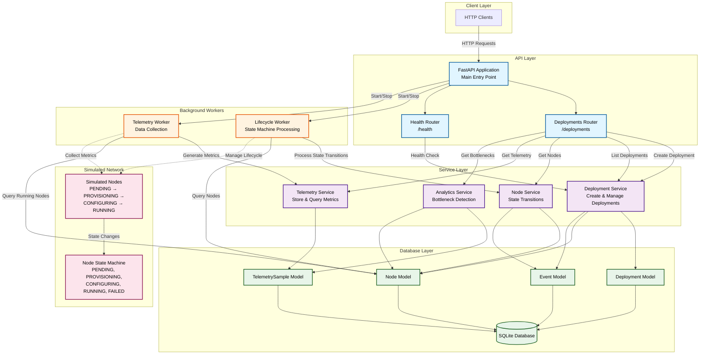

```mermaid
flowchart TB
    subgraph "Client Layer"
        Client[HTTP Clients]
    end

    subgraph "API Layer"
        FastAPI[FastAPI Application<br/>Main Entry Point]
        DeployRouter[Deployments Router<br/>/deployments]
        HealthRouter[Health Router<br/>/health]
    end

    subgraph "Service Layer"
        DeployService[Deployment Service<br/>Create & Manage Deployments]
        NodeService[Node Service<br/>State Transitions]
        TelemetryService[Telemetry Service<br/>Store & Query Metrics]
        AnalyticsService[Analytics Service<br/>Bottleneck Detection]
    end

    subgraph "Background Workers"
        LifecycleWorker[Lifecycle Worker<br/>State Machine Processing]
        TelemetryWorker[Telemetry Worker<br/>Data Collection]
    end

    subgraph "Database Layer"
        DB[(SQLite Database)]
        DeployModel[Deployment Model]
        NodeModel[Node Model]
        TelemetryModel[TelemetrySample Model]
        EventModel[Event Model]
    end

    subgraph "Simulated Network"
        SimNodes[Simulated Nodes<br/>PENDING → PROVISIONING →<br/>CONFIGURING → RUNNING]
        NodeStates[Node State Machine<br/>PENDING, PROVISIONING,<br/>CONFIGURING, RUNNING, FAILED]
    end

    %% Client to API
    Client -->|HTTP Requests| FastAPI
    FastAPI --> DeployRouter
    FastAPI --> HealthRouter

    %% API to Services
    DeployRouter -->|Create Deployment| DeployService
    DeployRouter -->|List Deployments| DeployService
    DeployRouter -->|Get Nodes| NodeService
    DeployRouter -->|Get Telemetry| TelemetryService
    DeployRouter -->|Get Bottlenecks| AnalyticsService
    HealthRouter -->|Health Check| DeployService

    %% Services to Database
    DeployService --> DeployModel
    DeployService --> NodeModel
    DeployService --> EventModel
    NodeService --> NodeModel
    NodeService --> EventModel
    TelemetryService --> TelemetryModel
    AnalyticsService --> TelemetryModel
    AnalyticsService --> NodeModel

    %% Database Models
    DeployModel --> DB
    NodeModel --> DB
    TelemetryModel --> DB
    EventModel --> DB

    %% Workers to Services
    LifecycleWorker -->|Process State Transitions| NodeService
    LifecycleWorker -->|Query Nodes| NodeModel
    TelemetryWorker -->|Generate Metrics| TelemetryService
    TelemetryWorker -->|Query Running Nodes| NodeModel

    %% Workers to Simulated Nodes
    LifecycleWorker -.->|Manage Lifecycle| SimNodes
    TelemetryWorker -.->|Collect Metrics| SimNodes
    SimNodes -->|State Changes| NodeStates

    %% FastAPI manages workers
    FastAPI -->|Start/Stop| LifecycleWorker
    FastAPI -->|Start/Stop| TelemetryWorker

    %% Styling
    classDef apiLayer fill:#e1f5ff,stroke:#01579b,stroke-width:2px,color:#000
    classDef serviceLayer fill:#f3e5f5,stroke:#4a148c,stroke-width:2px,color:#000
    classDef workerLayer fill:#fff3e0,stroke:#e65100,stroke-width:2px,color:#000
    classDef dbLayer fill:#e8f5e9,stroke:#1b5e20,stroke-width:2px,color:#000
    classDef simLayer fill:#fce4ec,stroke:#880e4f,stroke-width:2px,color:#000

    class FastAPI,DeployRouter,HealthRouter apiLayer
    class DeployService,NodeService,TelemetryService,AnalyticsService serviceLayer
    class LifecycleWorker,TelemetryWorker workerLayer
    class DB,DeployModel,NodeModel,TelemetryModel,EventModel dbLayer
    class SimNodes,NodeStates simLayer
```
